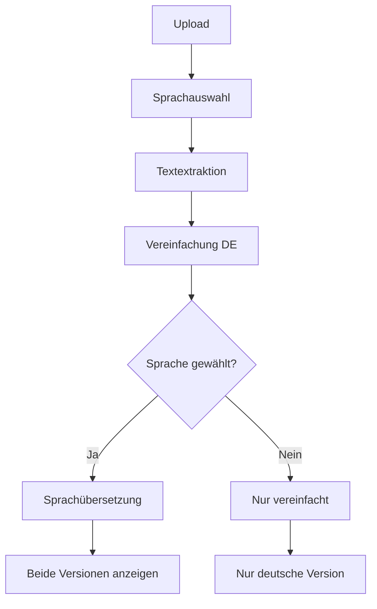

# Sprachübersetzung - Neue Funktionalität

## 📋 Übersicht

Die HealthLingo-Anwendung wurde um eine neue Funktionalität erweitert: **optionale Übersetzung** des vereinfachten medizinischen Textes in andere Sprachen. Diese Funktion nutzt das bereits installierte Ollama-Modell `mannix/llamax3-8b-alpaca:latest`.

## 🚀 Neue Features

### 1. Backend-Erweiterungen

#### Neue Datenmodelle (`app/models/document.py`)
- **`SupportedLanguage`**: Enum mit 95+ unterstützten Sprachen
- **`ProcessingOptions`**: Neue Klasse für Verarbeitungsoptionen
- **`LANGUAGE_NAMES`**: Mapping von Sprachcodes zu lesbaren Namen
- Erweiterte **`TranslationResult`**: 
  - `language_translated_text`: Übersetzter Text in Zielsprache
  - `target_language`: Gewählte Zielsprache
  - `language_confidence_score`: Qualitätsscore der Übersetzung

#### Erweiterte Services

**Ollama Client (`app/services/ollama_client.py`)**
- Neue Methode `translate_to_language()`: Übersetzt vereinfachten Text in andere Sprachen
- Optimierte Prompts für Sprachübersetzungen
- Qualitätsbewertung für Übersetzungen

**Process Router (`app/routers/process.py`)**
- Erweiterte Verarbeitungslogik mit optionaler Sprachübersetzung
- Neuer Status: `LANGUAGE_TRANSLATING`
- Neuer API-Endpunkt: `GET /process/languages` - Abrufen verfügbarer Sprachen

### 2. Frontend-Erweiterungen

#### Neue TypeScript-Typen (`frontend/src/types/api.ts`)
- **`ProcessingOptions`**: Interface für Verarbeitungsoptionen
- **`SupportedLanguage`**: Interface für Sprachobjekte  
- **`AvailableLanguagesResponse`**: Response für Sprachenliste
- Erweiterte **`TranslationResult`**: Felder für Sprachübersetzung

#### Erweiterte Services (`frontend/src/services/api.ts`)
- **`getAvailableLanguages()`**: Lädt verfügbare Sprachen
- Erweiterte **`startProcessing()`**: Akzeptiert Verarbeitungsoptionen
- Erweiterte Status-Texte für Sprachübersetzung

#### UI-Komponenten

**App.tsx**
- Neue State-Variablen für Sprachauswahl
- `renderLanguageSelector()`: Benutzerfreundliche Sprachauswahl
- Integration der Sprachoptionen in den Upload-Workflow

**TranslationResult.tsx**
- Tab-System für verschiedene Sprachversionen
- Anzeige beider Übersetzungen (vereinfacht + Sprache)
- Getrennte Qualitätsindikatoren
- Erweiterte Download-Funktionalität

## 🎯 Unterstützte Sprachen

Die Funktionalität unterstützt **95+ Sprachen**, darunter:

### Beliebte Sprachen
- 🇩🇪 German (de) - *Standard für Vereinfachung*
- 🇺🇸 English (en)
- 🇪🇸 Spanish (es)  
- 🇫🇷 French (fr)
- 🇮🇹 Italian (it)
- 🇵🇹 Portuguese (pt)
- 🇳🇱 Dutch (nl)
- 🇵🇱 Polish (pl)
- 🇹🇷 Turkish (tr)
- 🇷🇺 Russian (ru)
- 🇸🇦 Arabic (ar)
- 🇨🇳 Chinese Simplified (zho)
- 🇯🇵 Japanese (ja)
- 🇰🇷 Korean (ko)

### Zusätzliche Sprachen
Viele weitere Sprachen wie Hindi, Bengali, Tamil, Vietnamese, Thai, und regionale Sprachen.

## 🔧 Technische Implementation

### Workflow

1. **Dokumenten-Upload**: Benutzer lädt medizinisches Dokument hoch
2. **Sprachauswahl** *(neu)*: Optional eine Zielsprache wählen
3. **Textextraktion**: Wie bisher (PDF/Bild → Text)
4. **Vereinfachung**: Text wird in einfache deutsche Sprache übersetzt
5. **Sprachübersetzung** *(neu)*: Falls gewählt, Übersetzung in Zielsprache
6. **Anzeige**: Beide Versionen (vereinfacht + übersetzt) werden angezeigt

### API-Endpoints

```http
# Neue Endpoints
GET /api/process/languages         # Verfügbare Sprachen abrufen
POST /api/process/{id}             # Verarbeitung mit Optionen starten
  Body: { "target_language": "en" }
```

### Datenfluss



## 🧪 Testing

Ein Test-Skript ist verfügbar:

```bash
cd backend
python test_language_translation.py
```

Das Skript testet:
- Ollama-Verbindung
- Verfügbare Modelle  
- Sprachübersetzungen
- API-Funktionalität

## 📋 Konfiguration

### Backend

Die Funktionalität nutzt das Modell `mannix/llamax3-8b-alpaca:latest`. Stelle sicher, dass es verfügbar ist:

```bash
ollama list | grep mannix/llamax3-8b-alpaca
```

### Frontend

Keine zusätzliche Konfiguration erforderlich. Die Sprachauswahl wird automatisch geladen.

## 🎨 Benutzerführung

### Workflow für Benutzer

1. **Datei hochladen** - wie gewohnt
2. **Sprache wählen** (optional):
   - Beliebte Sprachen als Buttons
   - "Nur vereinfachen" für keine Übersetzung
   - Ausgewählte Sprache wird angezeigt
3. **Verarbeitung starten** - automatisch nach Upload
4. **Ergebnisse ansehen**:
   - Tabs zwischen Deutsch (vereinfacht) und Zielsprache
   - Getrennte Qualitätsindikatoren
   - Download enthält beide Versionen

### UI-Verbesserungen

- 🎯 **Intuitive Sprachauswahl**: Quick-Buttons für beliebte Sprachen
- 📊 **Tab-System**: Einfacher Wechsel zwischen Versionen  
- 🎨 **Konsistentes Design**: Passt zum bestehenden UI
- 📱 **Responsive**: Funktioniert auf allen Geräten

## 🔒 Datenschutz & Sicherheit

- ✅ **Lokale Verarbeitung**: Alle LLM-Aufrufe bleiben lokal (Ollama)
- ✅ **Keine externen APIs**: Keine Daten verlassen das System
- ✅ **Temporäre Speicherung**: Wie bisher - automatische Löschung
- ✅ **DSGVO-konform**: Keine zusätzlichen Datenschutz-Risiken

## 🚀 Deployment

### Docker

Die Funktionalität ist vollständig in die bestehende Docker-Konfiguration integriert:

```bash
# Normale Deployment-Befehle
docker-compose up -d
```

### Produktionsumgebung

Keine zusätzlichen Services erforderlich. Nutzt bestehende Ollama-Installation.

---

**🎉 Die Sprachübersetzungsfunktionalität ist vollständig integriert und einsatzbereit!** 